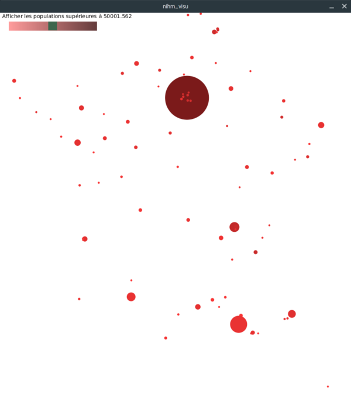
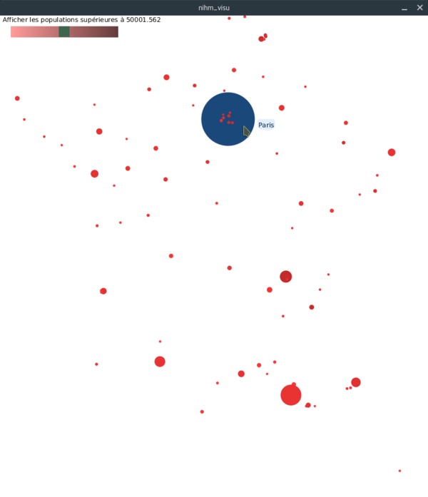
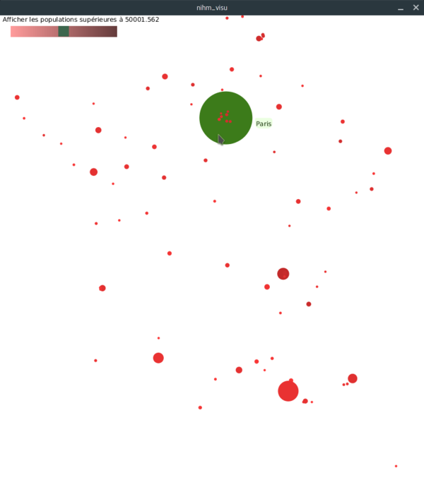
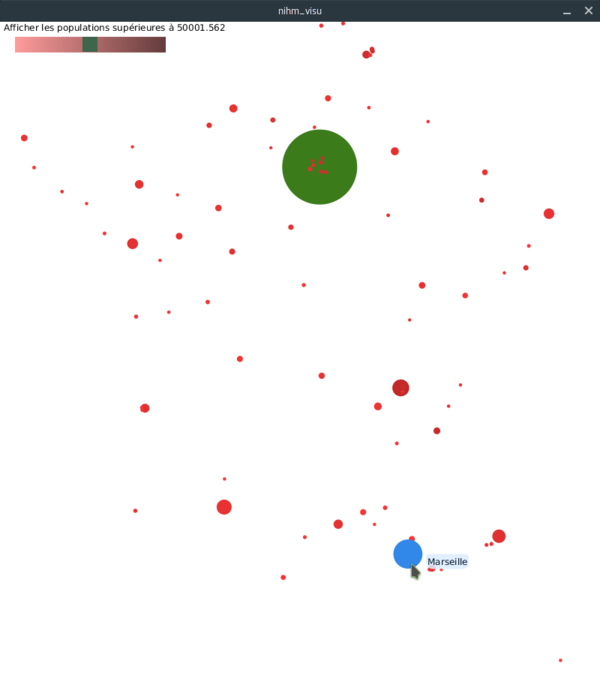
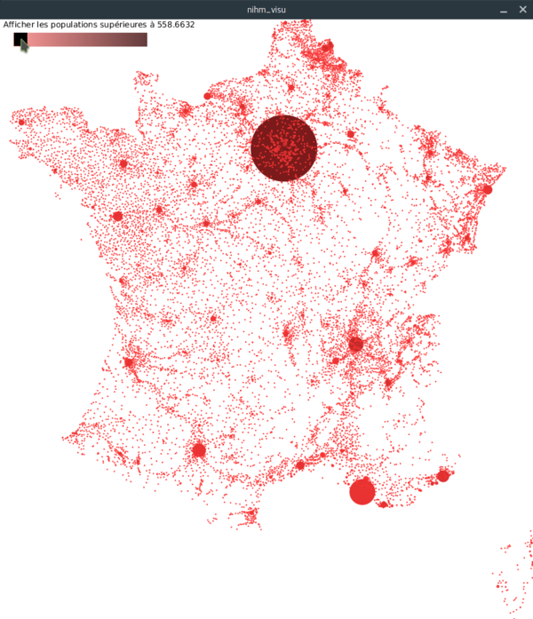

# TP Visualisation
#### Arnaud Cojez

Le sujet est disponible à cette [adresse](http://www.thomaspietrzak.com/enseignement/NIHM/tpvisu3.htm).

__________________
## Utilisation

Le projet Processing est téléchargeable [ici](https://github.com/arnaudcoj/m2s3_nihm_visualisation/archive/master.zip).

Pour utiliser l'application, il faut :

* télécharger l'archive du projet (lien ci-dessus) ;
* dézipper l'archive ;
* lancer Processing ;
* ouvrir le sketch ```nihm_visu.pde```.

__________________
## Visualisations

* Les villes sont affichées à l'aide de cercles, en fonction de leur position géographiques ;

* Le rayon d'un cercle est défini par la quantité de population habitant dans la ville. Nous pouvons donc, d'un coup d'oeil, distinguer les villes fortement peuplées (et donc importantes) par rapport aux villes faiblement peuplées ;

* La couleur du cercle est définie par la densité de population dans la ville. Cette visualisation est plus subtile, mais on comprend "instinctivement" que plus une ville est d'une couleur foncée, plus elle est dense.



__________________
## Fonctionnalités

### Survol d'une ville par la souris

Lorsque l'on survole une ville avec la souris, celle-ci se colore en bleue, et une étiquette contenant le nom de la ville s'affiche à côté.



### Sélection d'une ville à la souris

Lorsque l'on clique sur une ville, celle-ci se colore en vert. Lorsque l'on sort le curseur de la ville, cette dernière reste selectionnée.



Nous pouvons survoler une autre ville (qui se colorera en bleu) tandis que la ville selectionnée reste colorée en vert.



### Slider permettant de filtrer les villes en fonction du nombre d'habitants

Un slider permettant de filtrer l'affichage des villes en fonction de leur population a été implémenté. Celui-ci s'étend de 3.125 habitants à 100 000 habitants.




__________________
## Sources

Certaines parties de code ont été tirées des pages suivantes :

* [tpvisu1](http://www.thomaspietrzak.com/enseignement/NIHM/tpvisu1.htm) ;
* [tpvisu2](http://www.thomaspietrzak.com/enseignement/NIHM/tpvisu2.htm) ;
* [tpvisu3](http://www.thomaspietrzak.com/enseignement/NIHM/tpvisu3.htm) ;
* [Processing : exemple Scrollbar](https://processing.org/examples/scrollbar.html).
